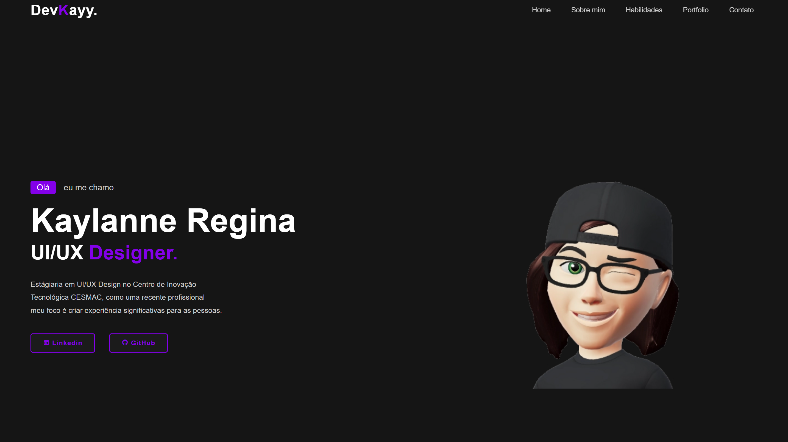

<h1 align="center">Portifólio - Kaylanne 💻</h1>

<h4 align="center"><a href="https://kayylanne.github.io/Portfolio/">Confira o projeto aqui</a></h4>

---

## 💻 Sobre

Projeto feito no intuito de me apresentar, como UI/UX Designer e Futura desenvolvedora Full-Stack.

## 🤯 O site é composto por:

- **Home:** Minha apresentação;
- **Sobre mim:** Falo um pouco sobre minha trajetória e meu estado atual;
- **Habilidades:** As tecnologias que tenho conhecimento;
- **Portfólio UI/UX:** Alguns projetos de protótipos recentes que fiz;
- **Portfólio Full-Stack:** Alguns projetos recentes que fiz;
- **Contato:** Área com um formulário e meios para contato comigo;

## 🧠 Tecnologias utilizadas:

O site **ainda está em desenvolvimento**, pois estou em constante aprendizado. Mas até aqui utilizei as tecnologias:

    
    
    

## 📚 Alguns conceitos aplicados

Neste projeto apliquei os seguintes pontos:
+ Semântica HTML;
+ Pontos de acessibilidade;
+ Responsividade;
+ Mobile first;

---

<table>
  <tr>
    <td>
      
    </td>
    <td>
      Feito por <a href="https://github.com/KayyLanne">Kaylanne Regina.</a> 🙋🏻‍♀️
    </td>
  </tr>
</table>

## 🏆 Licença

The [MIT License](./LICENSE).

